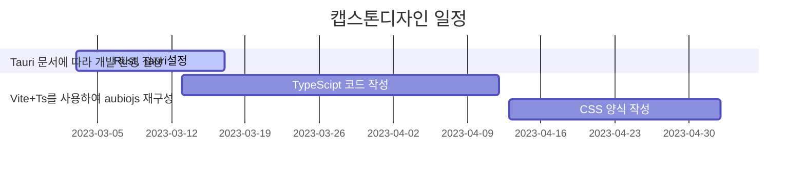

# aubiojs

| 프로젝트 주제 | Tauri통해 Tuner 크로스 플랫폼 애플리케이션 |
| :-----------: | :----------------------------------------: |
|     팀원      |                   강영걸                   |
|    작성일     |                 2023.03.08                 |

## 프로젝트 배경

- 악기 연주를 할 때 항상 기준 조율을 해야 하는데 일반적으로 모두 네이티브 소프트웨어를 통해 이루어지는데 브라우저는 성능 문제로 인해 정확한 음고 검출을 할 수 없다.
- 캡스톤디자인(1)웹 버전만 제작했는데 이번 학기에는 Tauri 프레임을 사용하여 크로스 플랫폼(Windows, Mac, Linux)애플리케이션을 만들 것이다.

## 캡스톤디자인 목표

- Tauri통해 Tuner 크로스 플랫폼 애플리케이션(WebAssembly 기반 브라우저 실시간 피치 감지)

## 캡스톤디자인 관련 조사

- Tauri는 웹을 기반으로 Desktop Application을 빌드할 수 있는 툴킷이며, 거의 모든 프론트엔드 프레임워크와 호환된다는 것이 큰 장점이다. 백엔드 언어는 Rust기반이며 CLI(Command line interface)은 Node.js가 사용되었다. 웹 기반 데스크탑 앱을 개발한다는 점에서 비슷한 프레임워크인 Electron과 유사한 점이 많고 그만큼 장단점이 확연하게 갈린다
- 거의 모든 프론트엔드 프레임워크들 간 호환이 가능하며, 기본적인 스택인 HTML/CSS/JavasScript부터 Next.js, SvelteKit, Vite를 통해 더욱 쉽고 빠르게 사용할 수 있다. (기존 프로젝트에도 연동하여 사용할 수 있다.)
- Tauri는 Webview를 자체 개발한 WRY를 사용함으로써 런타임 퍼포먼스에서 상당한 이점을 가져다준다. 또한 인스톨러 2.5MB, 총설치 용량 3.64MB라는 가벼운 크기가 장점이다.
- Rust 언어를 기반으로 구동이 되기 때문에 Rust의 도구들을 직접적으로 사용할 수 있으며, 웹 기반 앱이라는 점이 가져다주는 취약점을 대부분 상쇄시켜준다.

## 캡스톤디자인 과정

- Tauri 문서에 따라 개발 환경 설정
- Vite+Ts를 사용하여 aubiojs 재구성

## 캡스톤디자인 일정

